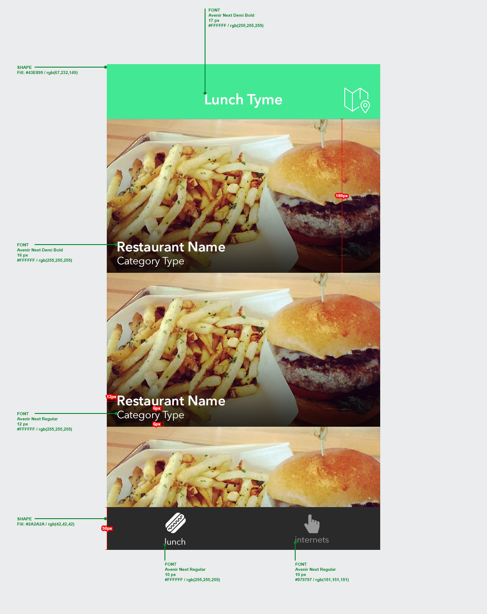

# RestaurantSampleApp

# Bottle Rocket iOS Engineering Test
## Introduction
    -The intention of this coding test is to assess your ability to work with requirements commonly seen at Bottle Rocket. We want you to display your knowledge of best practices and software design. Write clean code and demonstrate your knowledge of object-oriented programming concepts.
    -You will create a universal iOS app that meets the requirements below. You should build the app using the latest available version of Xcode and the iOS SDK. You need only support the latest iOS version, so you may use any of the latest frameworks that Apple makes available.
    -Your code should conform to Bottle Rocket’s coding guidelines. These guidelines can be found on the Bottle Rocket GitHub. In particular, pay attention to brace style and spacing between components.
## Requirements
    -Create a new application using a UITabBarController. This tab bar controller will have two tabs: one named “lunch” and one named “internets”.
    -For the first tab, “lunch,” you will create a UICollectionView that will display content from the JSON data feed found at https://s3.amazonaws.com/br-codingexams/restaurants.json.
            -Design a data model to contain the restaurant objects returned in the JSON feed.
            -Fetch the data from the internet asynchronously.
            -Display the data in a UICollectionView with custom cells.
            -Images for the cell background and restaurant logos are located in URLs found on the model objects in the JSON feed. You should fetch and cache these images asynchronously and display them in the cells.
            -Tapping on one of the restaurant cells should push a restaurant detail view controller onto the stack of a UINavigationController.
            -Optional: create a map screen that displays all of the restaurants in the feed based on their latitude and longitude. You should present this view controller in a modal that triggers when the user taps the map icon on the upper right, as shown in the blueprint.
    -For the second tab, “internets”, you will create a simple web browser programmatically (in code), without using interface builder, while still using auto-layout to ensure the view displays correctly.
            -Upon initial load of your web view controller, display this URL: https://www.bottlerocketstudios.com. 
            -Provide support for Back, Next, and Refresh functionality as you would see in a full-featured web browser implementation.
    -No cocoa pods are allowed. Third party libraries for image fetching and caching are not recommended. We want to see what you can, or cannot, do.
    -Your application should match the style defined in the documents included in the archive along with this requirements document. There are images for the three screens in the Blueprints folder, called list.png, detail.png, and web.png. A folder with cuts (images) that should be used in your application has also been provided.
    -Your application must use auto layout and should render correctly on all current iOS phones. It should also render correctly on iPad. For iPad, you should use a two-column layout for the collection view in the “lunch” tab and handle autorotation events. The iPhone version only needs to support the portrait orientation.
    -Optional: Feel free to add any polish you like to the app. You may add some animations, custom view controller transitions, etc. At Bottle Rocket we try to make our apps as polished and interesting as possible, so show us what you can do!

# Restaurant List Screen

# Detail Screen

# Web Screen
